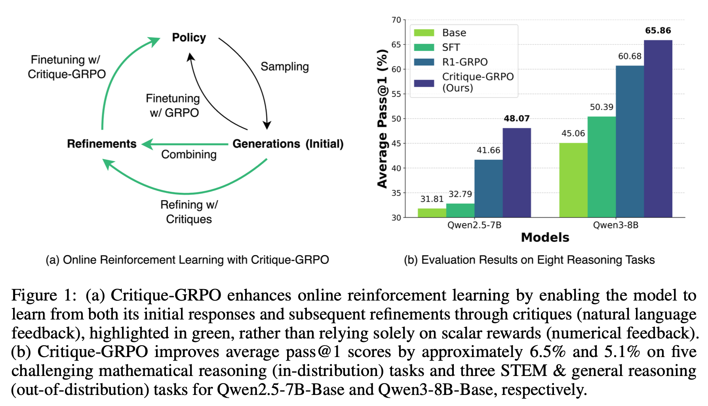
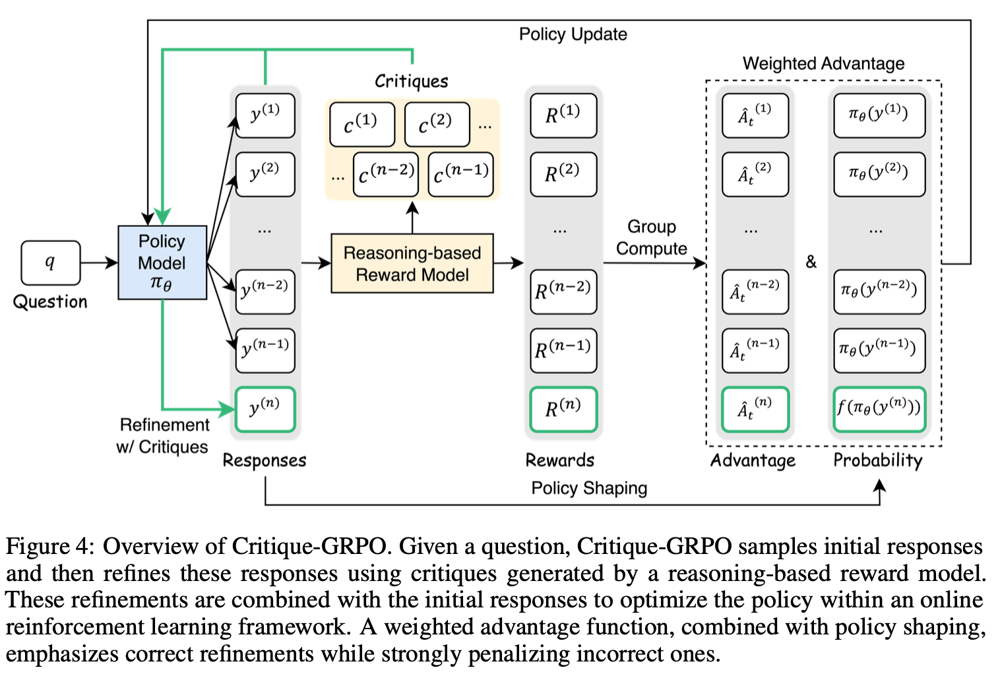
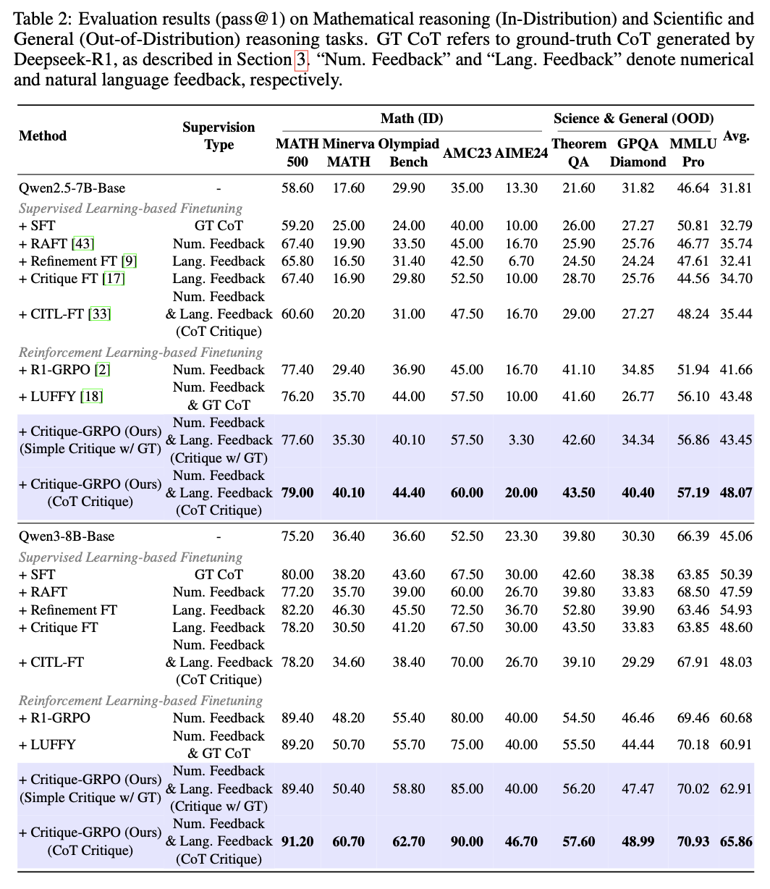

**Critique-GRPO: Advancing LLM Reasoning with Natural Language and Numerical Feedback**  
[](https://www.arxiv.org/abs/2506.03106)

---



## Overview

Recent advances in reinforcement learning (RL) with numerical feedback, such as scalar rewards, have significantly enhanced the complex reasoning capabilities of large language model (LLMs). Despite this success, we identify three key challenges encountered by RL with solely numerical feedback: performance plateaus, limited effectiveness of self-reflection, and persistent failures. We then demonstrate that RL-finetuned models, even after exhibiting performance plateaus, can generate correct refinements on persistently failed problems by leveraging natural language feedback in the form of critiques. Building on this insight, we propose Critique-GRPO, an online RL framework that integrates both natural language and numerical feedback for effective policy optimization. Critique-GRPO enables LLMs to learn from initial responses and critique-guided refinements simultaneously while maintaining exploration. 

---

## Key Contributions

- **Improved Reasoning Performance**: Critique-GRPO consistently outperforms supervised learning-based and RL-based fine-tuning approaches across *eight challenging tasks*, including:
  - Mathematical reasoning
  - STEM problem-solving
  - General reasoning tasks  
  Average pass@1 scores improved by approximately **4.5%** and **5%**, respectively, using:
  - **Qwen2.5-7B-Base**
  - **Qwen3-8B-Base**

- **Better Policy Exploration**: Critique-GRPO surpasses a strong baseline that incorporates expert demonstrations within online RL. Further analysis reveals:
  - **Higher entropy** does not always guarantee efficient learning from exploration.
  - **Longer responses** do not necessarily lead to more effective exploration.

- **Critique-Guided Refinements**: RL-finetuned models using Critique-GRPO demonstrate the ability to generate correct refinements for persistently failed problems, leveraging natural language critiques effectively.  

---

## Results

### Key Findings
1. **Performance Improvements**:
   - Critique-GRPO outperforms traditional supervised and RL-based fine-tuning approaches.
   - Average pass@1 improvements:
     - **+4.5%** on Qwen2.5-7B-Base
     - **+5.0%** on Qwen3-8B-Base  

2. **Exploration Insights**:
   - Higher entropy does not always lead to better learning.
   - Concise, critical reasoning is more effective than overly long responses.

### Figures
#### Critique-GRPO Framework


#### Main Results


---
The code is coming soon! Expect a release in 1–2 weeks. Stay tuned!

---
## Citation

If you find this work useful, please cite:

```bibtex
@misc{zhang2025critiquegrpoadvancingllmreasoning,
      title={Critique-GRPO: Advancing LLM Reasoning with Natural Language and Numerical Feedback}, 
      author={Xiaoying Zhang and Hao Sun and Yipeng Zhang and Kaituo Feng and Chaochao Lu and Chao Yang and Helen Meng},
      year={2025},
      eprint={2506.03106},
      archivePrefix={arXiv},
      primaryClass={cs.CL},
      url={https://arxiv.org/abs/2506.03106}, 
}
