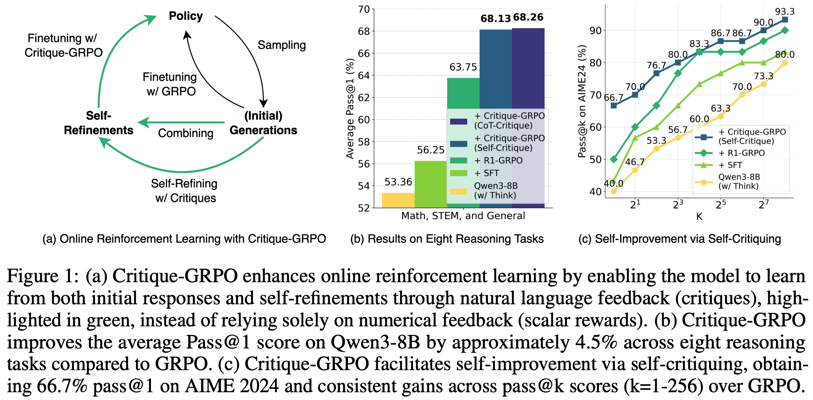
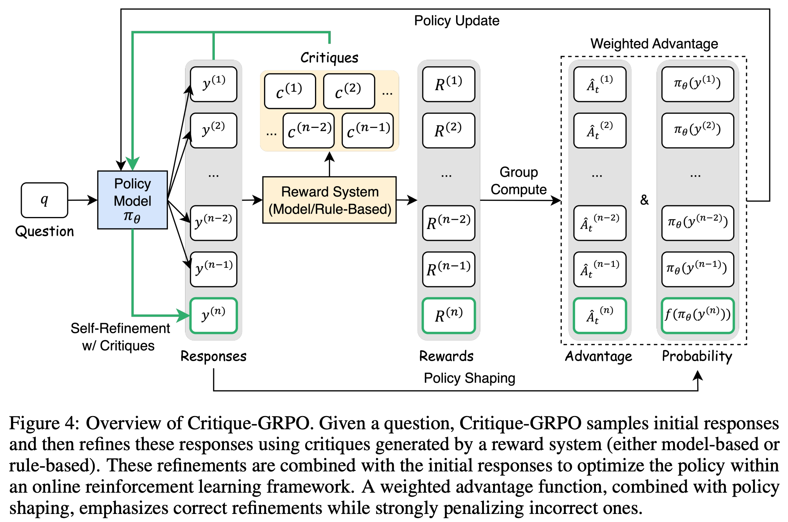
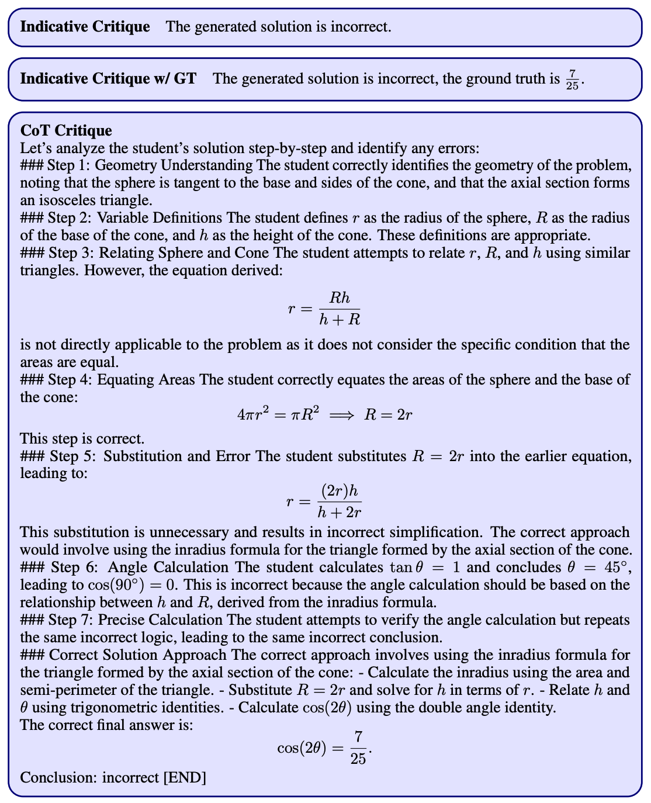

# **Critique-GRPO: Advancing LLM Reasoning with Natural Language and Numerical Feedback**  

## Overview

Recent advances in reinforcement learning (RL) with numerical feedback have significantly enhanced the complex reasoning capabilities of large language models (LLMs). However, we identify three critical limitations of pure numerical feedback:

1. **Best performance plateaus** in later training stages
2. **Limited efficacy of spontaneous self-reflection** mechanisms
3. **Persistent failures** on challenging problems

Our analysis reveals that RL-finetuned models can generate correct refinements for persistently failed problems when provided with natural language critiques. This insight led to **Critique-GRPO**, an online RL framework that synergistically combines:

- Natural language feedback (critiques)
- Numerical rewards
- Novel exploration mechanisms

Key innovations include:
- Simultaneous learning from initial responses and critique-guided refinements

## Key Results

| Model                | Avg. Pass@1 Improvement |
|----------------------|-----------------------|
| Qwen2.5-7B-Base      | +4.4%                |
| Qwen3-8B (w/ Thinking)| +3.8%               |

**Notable achievements**:
- 16.7% improvement on AIME 2024 (vs GRPO)
- 10.0% weak-to-strong generalization gain
- Effective self-improvement through self-critiquing

## Released Resources

- **Model**: [Qwen3-8B Critique-GRPO](https://huggingface.co/xyingzhang/critique_grpo_math_4k_qwen3_8b_rollout7_self_critique_1_global_step_300)
  - Fine-tuned with self-critiquing capability
  - Optimized for mathematical reasoning
- **Code**: Coming soon! (Stay tuned)

## Key Contributions

1. **Dual-Feedback Optimization**:
   - First framework to effectively combine natural language critiques with numerical rewards
   - Addresses the "plateau and forget" problem in RL fine-tuning

2. **Consistent Performance Gains**:
   - Outperforms baselines across 8 challenging benchmarks:
     - Mathematical reasoning (AIME, MATH)
     - STEM problem-solving
     - General reasoning tasks

3. **Practical Advancements**:
   - Demonstrated weak-to-strong generalization
   - Scalable self-improvement through self-critiquing
   - Computationally efficient shaping function

## Methodology

Critique-GRPO operates through three phases:

1. **Initial Response Generation**:
   - Standard reasoning attempt
   - Receives numerical reward

2. **Critique-Guided Self-Refinement**:
   - Generates natural language critiques
   - Produces refined solutions
   - Receives shaped reward

3. **On-policy Optimization**:
   - Simultaneous policy updates from both initial generations and their refinements

